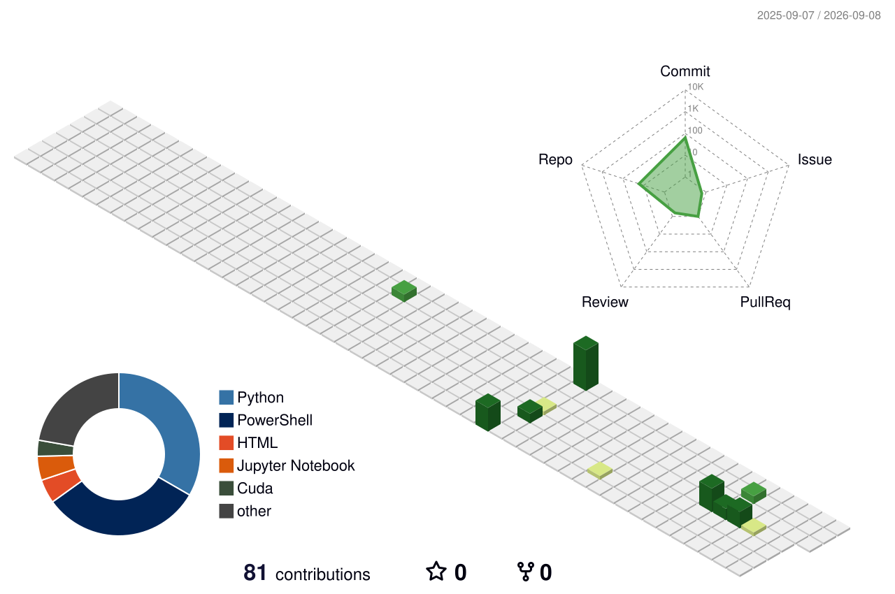

# Akash Sadamwar

<picture>
  <source media="(prefers-color-scheme: dark)" srcset="https://readme-typing-svg.demolab.com?font=Fira+Code&weight=600&size=24&pause=900&color=58A6FF&center=true&vCenter=true&width=760&lines=Python+Backend+%26+AI+Systems+Engineer;Cloud-Native+%7C+Distributed+%7C+Secure;Building+systems+that+scale">
  <source media="(prefers-color-scheme: light)" srcset="https://readme-typing-svg.demolab.com?font=Fira+Code&weight=600&size=24&pause=900&color=0969DA&center=true&vCenter=true&width=760&lines=Python+Backend+%26+AI+Systems+Engineer;Cloud-Native+%7C+Distributed+%7C+Secure;Building+systems+that+scale">
  
</picture>

**Software Developer · Python Backend · Cloud-Native Systems · Agentic AI**

## About

I build secure, high-throughput backend and AI-enabled products for financial platforms. At **Broadridge Financial Solutions**, I work across Python microservices, event-driven processing, AWS infrastructure, and LLM/agent integrations. Previously, I built distributed payment services at **Mastercard**.

- Designing APIs and microservices with Python, FastAPI, Django, PostgreSQL, and Redis
- Building asynchronous systems with Kafka and Celery
- Shipping cloud-native workloads with AWS, Docker, Kubernetes, and Terraform
- Integrating Agentic AI, LLM workflows, and Model Context Protocol (MCP)

## Featured work

| Project | Engineering focus |
| --- | --- |
| **[PayFlow](https://github.com/akashsadamwar/PayFlow)** | Distributed payment orchestration with FastAPI, Kafka, Redis/Celery, PostgreSQL reconciliation, idempotency, and Kubernetes observability |
| **[FlashAttention-2 from scratch](https://github.com/akashsadamwar/The-repository-folder-name-is-Reimplementation_flash-attention-from-scratch-)** | 16 CUDA optimization stages reaching 99.2% of the official implementation's A100 performance at sequence length 4096 |
| **[MarketFlow](https://github.com/akashsadamwar/marketflow-ecommerce-platform)** | Full-stack commerce platform with FastAPI, Next.js 14, PostgreSQL, JWT/RBAC, and Docker Compose |

<b>Graph-Based RAG Autonomous Agent</b>

Built with LlamaIndex and dual-store FAISS retrieval across five LLM backends, reducing measured hallucinations by 35% while delivering sub-200 ms responses.

## 3D contribution skyline

  <picture>
    <source media="(prefers-color-scheme: dark)" srcset="./profile-3d-contrib/profile-night-rainbow.svg">
    <source media="(prefers-color-scheme: light)" srcset="./profile-3d-contrib/profile-green-animate.svg">
    
  </picture>

## Experience

| Company | Role | Selected impact |
| --- | --- | --- |
| **Broadridge Financial Solutions** | Software Developer · 2025-present | Improved API performance by 8%, system output by 21%, and analyst productivity by 18% |
| **Mastercard** | Software Engineer · 2020-2023 | Reduced API latency by 27%, improved database performance by 31%, and reduced incidents by 5% |

## Core stack

`Python` · `Java` · `TypeScript` · `FastAPI` · `Django` · `Spring Boot` · `PostgreSQL` · `MongoDB` · `Redis` · `Kafka` · `AWS` · `Docker` · `Kubernetes` · `Terraform` · `React` · `Agentic AI` · `MCP`

<b>Open the full engineering toolbox</b>

- **Backend:** REST APIs, WebSockets, microservices, distributed systems, SQLAlchemy, Celery
- **Cloud & delivery:** AWS EKS, AWS Aurora, Azure, Helm, GitHub Actions, Jenkins, CI/CD
- **Security:** OAuth 2.0, JWT, RBAC, encryption, secure API development
- **Quality & operations:** JUnit, Mockito, Postman, Prometheus, Grafana, observability

## Education

- **MS, Computer Science** — Binghamton University, 2025
- **BE, Electronics and Telecommunication Engineering** — Savitribai Phule Pune University, 2022

  Building reliable systems where backend engineering, cloud infrastructure, and applied AI meet.

